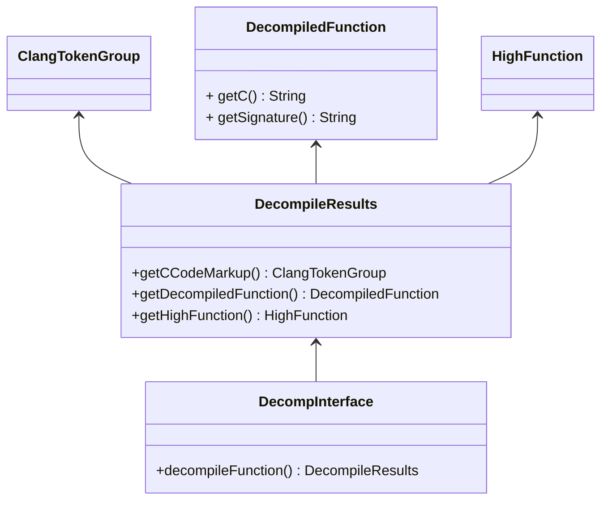
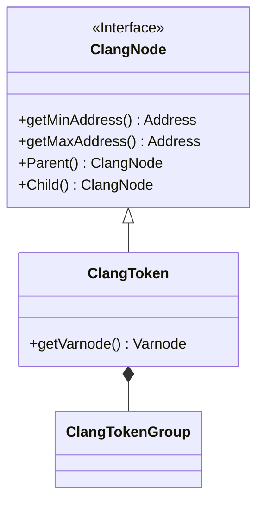
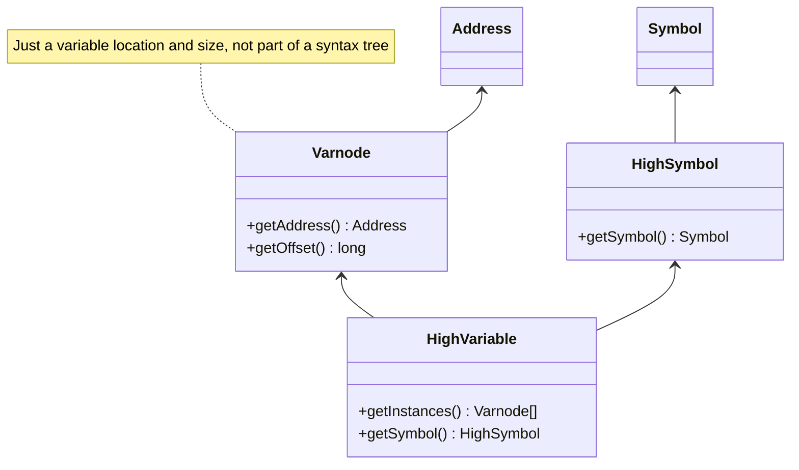

# Decompiler Type Hierarchy

This is a simplified version of the hierachy of classes and methods commonly used when using the decompiler API.

## Decompiler Engine 

## C Language Nodes

## Symbols, Variables, Varnodes

