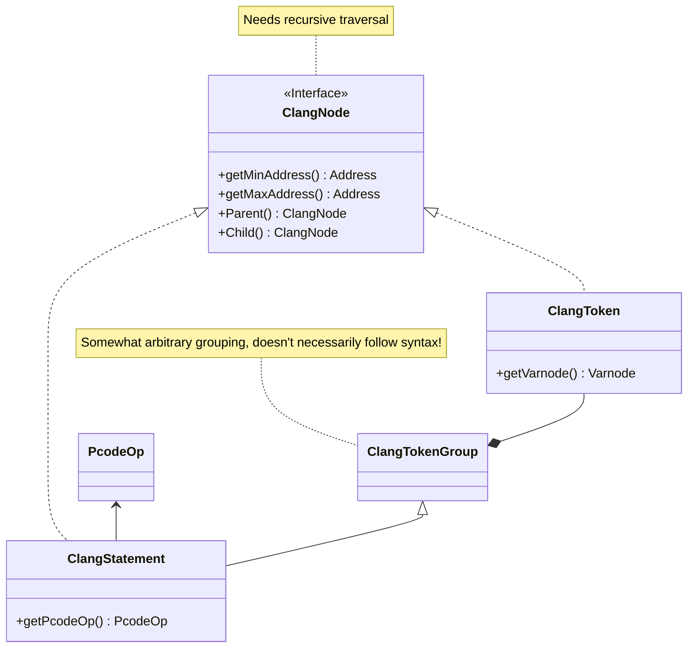
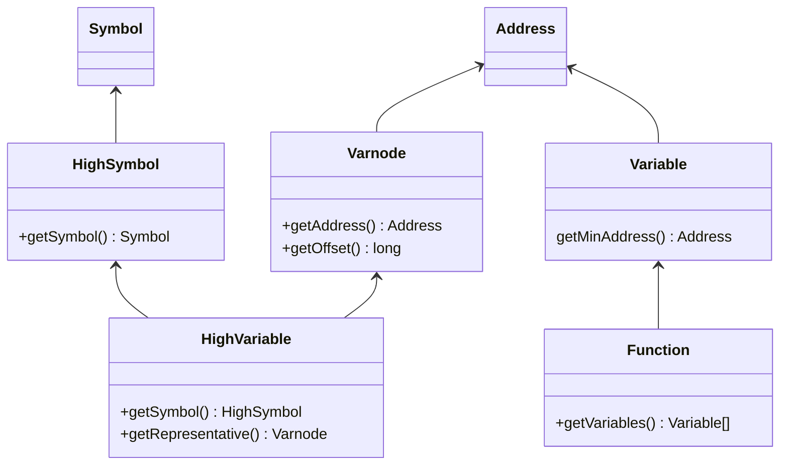

# Decompiler Type Hierarchy

This is a simplified version of the hierachy of classes and methods commonly used when using the decompiler API.

## Decompiler Engine 

## C Language Representation

### Nodes and Tokens

**Not all `Clang*Token` classes are inherited from `ClangToken` (e.g. `ClangVariableToken`)!**

## High-Level Representation

### Symbols, Variables, Varnodes

`HighVariable`s represent a _view_ on the underlying variable. The real, modifiable `Variable` object can be accessed by:

1. Retrieving the _representative_ varnode of the `HighVariable`.
2. Then match the address (`.getAddress().equals(...)`) with the minimum addresses of the variables known by the current function (`currentFunction.getVariables(null)`). This should handle stack/register address spaces too. 

